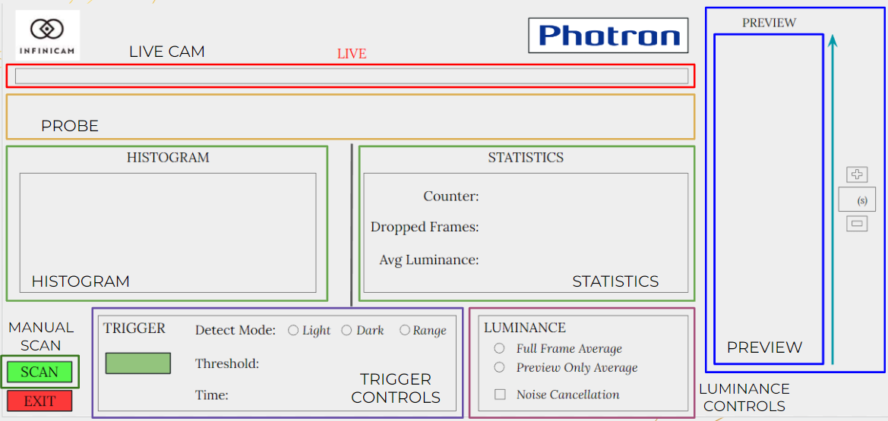
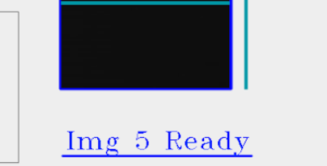
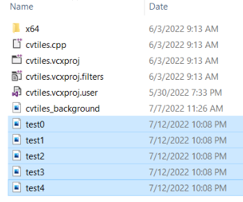

# cvtiles

cvtiles is a Windows sample application for USB high-speed streaming camera [INFINICAM UC-1](https://www.photron.co.jp/products/hsvcam/infinicam/).

It illustrates how the INFINICAM could be used to achieve real-time live image processing with simple capturing API that mimics OpenCV's Video Capture class [VideoCapture](https://docs.opencv.org/3.4/d8/dfe/classcv_1_1VideoCapture.html).

The code sample shows how to integrate INFINICAM into an application that uses OpenCV. The class takes the current frame and scans just 1 line of pixels, and then stacks these rows on top of one another to create a large final image that results in a high-definition scan, even for rapidly moving objects.

## CVTiles UI & Functions

**1. Live Cam:** Displays 1026 x 16 live feed from Infinicam

**2. Probe:** Displays luminance values of the middle row of pixels from Live Cam. Horizontal line indicates average luminance, and some basic object detection is implemented when an object crosses the luminance threshold (midpoint of the detected bright object is displayed over the Live Cam). 

**3. Histogram:** Displays distribution of luminance values across center row of pixels from Live Cam

**4. Statistics:** Updates to show relevant info as camera moves / different controls are activated

**5. Preview:** Shows what has been captured by Infinicam from the past few seconds; value can be adjusted using input buttons on the right. To change which 200 pixels of the 1024 pixels are captured into the Preview, move the sliding box in the Live Cam window.

**6. Luminance:** Determines how luminance from live feed is determined. Noise cancellation has a window of 30 frames (cannot be turned off in certain Trigger modes).

**7. Manual Scan:** Immediately takes a single row of pixels from the 30,000 frames and stacks them to create one large final image.

**8. Trigger:** Automatically creates a scan when object is detected as having passed in front of Infinicam. Click "On/Off" button to activate.

**8a. Threshold & Time:** Threshold & time can be changed by dragging the sliders in the Histogram & Preview boxes, respectively. Threshold changes when the trigger activates, based on the different Detect Modes. Time gives a delta valye in the past for when the scan will begin from.

**8b. Detect Modes:**
	I. Light Trigger: only activates when average luminance crosses above the set threshold.
	II. Dark Trigger: only activates when average luminance crosses below the set threshold.
	III. Range Trigger: only activates when the average luminance rapidly changes above or below the given threshold.

 
The most recent scan, either from Manual Scan or the Trigger, can be viewed by clicking on the text that will appear in the bottom right corner after the scan is complete.

All previous scans are saved to files and automatically named as "test[#]". 

## Environment
* installed Visual Studio 2019

* OpenCV Version 4.2.0 or higher (included in the Photron GitHub repository)

## Build
1. Download and install [PUCLIB](https://www.photron.co.jp/products/hsvcam/infinicam/tech.html) SDK.

2. Clone this source code.

3. Set the environment variable OPENCV_DIR and set to the directory you installed OpenCV

4. Copy the OpenCV DLL's to the bin folder
   
5. Open [cvtiles.sln](./cvtiles.sln) on visual studio.

6. Build

------------

## Operation

1. Connect INIFINICAM UC-1 to your Windows PC with USB-C cable.
2. Launch cvtiles.exe in the bin folder.
3. The application will show the live output of the camera in a window.
4. To exit, hit ESC key after focusing to the live window, or click the "EXIT" button.

#### developed by: Photron Ltd.
